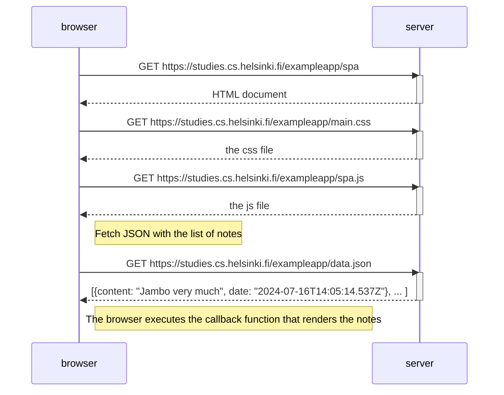

```mermaid
sequenceDiagram
    participant browser
    participant server

    browser->>server: GET  https://studies.cs.helsinki.fi/exampleapp/spa
    activate server
    server-->>browser: HTML document
    deactivate server

    browser->>server: GET https://studies.cs.helsinki.fi/exampleapp/main.css
    activate server
    server-->>browser: the css file
    deactivate server

    browser->>server: GET https://studies.cs.helsinki.fi/exampleapp/spa.js
    activate server
    server-->>browser: the js file
    deactivate server

    Note right of browser: Fetch JSON with the list of notes

    browser->>server: GET https://studies.cs.helsinki.fi/exampleapp/data.json
    activate server
    server-->>browser: [{content: "Jambo very much", date: "2024-07-16T14:05:14.537Z"}, ... ]
    deactivate server

    Note right of browser: The browser executes the callback function that renders the notes
```
